# Project Flow Alignment and Revised Class Diagram

## Quick Router

- **Canonical for:** compact runtime status index across modules, flow summary, and cross-doc navigation.
- **Read this when:** you need the fastest answer for what is implemented vs planned and which detailed doc to open next.
- **Read next:** `docs/api-design.md` for endpoint contracts, `docs/data-dictionary.md` for schema/constraints, `docs/system-design.md` for target design.
- **Not canonical for:** full request/response payload detail or field-by-field schema definitions.

## 1. Purpose

Dokumen ini menyelaraskan class diagram usulan dengan implementasi backend yang benar-benar ada saat ini.

Kesimpulan utamanya:

- project ini **bukan** Laravel MVC dengan Blade views;
- backend saat ini adalah **CodeIgniter 4 REST API**;
- frontend akan menjadi **Next.js client** yang mengonsumsi API;
- arsitektur aktual yang berjalan saat ini adalah **route/filter -> controller -> service -> model -> database**.

Source of truth yang dipakai untuk alignment ini:

- `app/Config/Routes.php`
- `app/Controllers/Api/V1/*`
- `app/Services/*`
- `app/Models/*`
- `app/Filters/RoleFilter.php`
- `app/Libraries/JsonApiExceptionHandler.php`
- `docs/api-design.md`
- `docs/system-design.md`

## 2. Why the Original Diagram Does Not Match the Current Project

Diagram awal memodelkan sistem sebagai aplikasi MVC server-rendered dengan layer `Views` seperti `DashboardView`, `InventoryView`, `SpkView`, `PatientView`, dan `MasterMenuView`.

Itu tidak cocok dengan codebase saat ini karena:

1. backend tidak merender flow UI untuk modul-modul bisnis tersebut;
2. route aktif yang ada sekarang adalah endpoint API di `/api/v1`;
3. business logic utama berada di **service layer**, bukan langsung di controller atau view;
4. beberapa modul pada diagram awal sudah diimplementasikan (Daily Patients, SPK), namun masih ada yang **planned** dan belum tersedia sebagai route aktif, terutama:
   - dashboard
   - audit reporting/export

## 3. Current Implemented Flow (As-Is)

### 3.1 Runtime Flow

```text
Next.js / any API client
        |
        v
/api/v1 routes
        |
        v
Filters
- cors
- tokens
- role
        |
        v
Controllers (HTTP adapters)
        |
        v
Services (business rules / transactions)
        |
        v
Models (persistence / queries)
        |
        v
MySQL / MariaDB
```

### 3.2 Observed Responsibilities

#### Controllers

Controller saat ini tipis dan berperan sebagai HTTP adapter:

- membaca request JSON atau query params;
- validasi shape input dasar;
- mengambil authenticated user dari token context;
- memanggil service;
- memetakan hasil service ke JSON response + HTTP status code.

Contoh:

- `App\Controllers\Api\V1\Auth`
- `App\Controllers\Api\V1\Items`
- `App\Controllers\Api\V1\StockTransactions`
- `App\Controllers\Api\V1\Users`
- `App\Controllers\Api\V1\Roles`
- `App\Controllers\Api\V1\ItemCategories`
- `App\Controllers\Api\V1\ItemUnits`
- `App\Controllers\Api\V1\TransactionTypes`
- `App\Controllers\Api\V1\ApprovalStatuses`

#### Services

Service adalah pusat business logic saat ini:

- `AuthService`
- `UserManagementService`
- `ItemManagementService`
- `StockTransactionService`
- `AuditService`

Khusus `StockTransactionService`, service ini sudah menangani:

- validasi domain transaksi stok;
- lookup `type_id` / `type_name`;
- revision workflow submit / approve / reject;
- database transaction;
- atomic stock mutation ke `items.qty`;
- audit logging.

#### Models

Model saat ini terutama menangani persistence dan query helper, misalnya:

- `ItemModel`
- `ItemCategoryModel`
- `ItemUnitModel`
- `StockTransactionModel`
- `StockTransactionDetailModel`
- `TransactionTypeModel`
- `ApprovalStatusModel`
- `RoleModel`
- `UserModel`
- `AppUserProvider`
- `AuditLogModel`

#### Cross-Cutting Components

- `RoleFilter` untuk RBAC di level route;
- Shield token auth (`tokens`) untuk autentikasi endpoint;
- `JsonApiExceptionHandler` untuk error response JSON global.

## 4. Module Status After Code Review

### 4.1 Module Status Summary

| Module | Current Status | Notes |
|---|---|---|
| Auth | Implemented | Login, me, logout, dan self-service change password sudah aktif |
| Roles | Implemented | `GET /api/v1/roles` aktif |
| Users | Implemented | CRUD + activate/deactivate/password flow aktif |
| Lookup APIs | Implemented | `roles`, `item-categories`, `transaction-types`, `approval-statuses`, `meal-times`, dan `item-units` aktif |
| Items | Implemented | CRUD aktif, `qty` tidak boleh diubah langsung |
| Stock Transactions | Implemented | Create/list/show/details/revision/approve/reject aktif |
| Dashboard | Implemented | `GET /api/v1/dashboard` aktif untuk ringkasan minimum per role |
| Audit Reporting / Export | Implemented (JSON Dataset) | endpoint `reports/*` aktif; export file (PDF/XLS) masih planned |

### 4.2 Compact Runtime Cross-Reference Matrix

Matriks ini adalah indeks cepat lintas dokumen. Gunakan tabel ini untuk menjawab pertanyaan “fitur ini statusnya apa, route aktifnya apa, flow utamanya apa, query/request pentingnya apa, siapa yang boleh akses, dan detailnya harus baca dokumen mana?”.

| Feature / Module | Runtime Status | API Surface | Key Flow / State Rules | Request / Query Summary | Access / Permission | Canonical Backend Docs |
|---|---|---|---|---|---|---|
| Auth | Implemented | `/auth/login`, `/auth/me`, `/auth/logout`, `/auth/password` | Login berbasis token Shield; self-service password change revoke semua token user | Login pakai `username` + `password`; password change butuh current password | `login` public; sisanya authenticated user | `docs/api-design.md`, `docs/system-design.md` |
| Roles | Implemented | `GET /roles` | Read-only lookup pada implemented baseline | List mendukung query lookup standar | `admin` only | `docs/api-design.md`, `docs/system-design.md`, `docs/typescript-sdk-maintenance-guide.md` |
| Users | Implemented | `/users`, `/users/{id}`, `/users/{id}/activate`, `/deactivate`, `/password`, `/users/{id}/restore` | Soft delete revoke token; activate/deactivate mengontrol login; role resolution bisa by id atau by name; restore bersifat idempotent, blok jika ada active-username duplikat; `username` unik secara global bahkan setelah soft delete | List mendukung `q/search`, `role_id`, `is_active`, sort, created/updated date range | `admin` only | `docs/api-design.md`, `docs/data-dictionary.md` |
| Lookup APIs | Implemented | `/item-categories`, `/item-units`, `/transaction-types`, `/approval-statuses`, `/roles`, `/meal-times` | Lookup soft delete tidak muncul di list/show; `item-categories` dan `item-units` pakai explicit restore; delete lookup tertentu diblok jika masih direferensikan | Semua lookup list mendukung `paginate=false`, `q/search`, sort, created/updated date range; envelope tetap `data/meta/links` | Read: `admin`, `gudang`; write untuk `item-categories` dan `item-units`: `admin` only; `roles` list: `admin` only | `docs/api-design.md`, `docs/data-dictionary.md` |
| Items | Implemented | `/items`, `/items/{id}`, `/items/{id}/restore` | `qty` tidak boleh diedit langsung; unit write pakai nama lalu di-resolve ke FK `item_unit_*`; delete bersifat soft delete; restore bersifat idempotent, blok jika ada active-name duplikat; `name` unik secara global bahkan setelah soft delete; create/update mengembalikan `restore_id` jika nama milik deleted item | List mendukung `item_category_id`, `is_active`, `q/search`, sort, created/updated date range; create/update menerima `item_category_id` atau `item_category_name` | Read/write: `admin`, `gudang`; delete/restore: `admin` only | `docs/api-design.md`, `docs/data-dictionary.md` |
| Stock Transactions | Implemented | `/stock-transactions`, `/stock-transactions/{id}`, `/details`, `/submit-revision`, `/approve`, `/reject`, `/stock-transactions/direct-corrections` | Transaksi stok adalah satu-satunya jalur mutasi stok; revision workflow submit/approve/reject adalah domain flow inti; direct stock correction tersedia untuk admin; audit logging aktif; **tidak ada DELETE route** — transaksi adalah audit record permanen | List mendukung `type_id`, `status_id`, `transaction_date_from/to`, `q/search`, sort, created/updated date range; create bisa `type_id` atau `type_name`; direct correction butuh `item_id`, `expected_current_qty`, `target_qty`, `reason` | Read/write dasar: `admin`, `gudang`; approve/reject & direct correction: `admin` only | `docs/api-design.md`, `docs/system-design.md` |
| Dashboard | Implemented (Minimum) | `/dashboard` | Agregasi minimum role-based summary untuk `admin`, `dapur`, `gudang` | Query belum dipublikasikan penuh; payload mengikuti kontrak role-based minimum | `admin`, `dapur`, `gudang` | `docs/api-design.md`, `app/Controllers/Api/V1/Dashboard.php` |
| Menu & Nutrition | Implemented | `/menus`, `/menu-dishes`, `/menu-schedules`, `/menu-calendar`, `/dishes`, `/dish-compositions` | Siklus menu 1-11; package header immutable (no menu create/delete route); calendar resolver otomatis (day 31 -> Pkt 11, Feb 29 -> Pkt 9, fallback % 10); slot menu per meal time (Pagi, Siang, Sore) | List menu `1..11`; calendar butuh `date`, `month`, atau `start_date`+`end_date` | Read: `admin,gudang`; write: `admin,dapur` | `docs/api-design.md`, `docs/system-design.md`, `docs/data-dictionary.md` |
| Daily Patients | Implemented | `/daily-patients`, `/daily-patients/{id}` | Input pasien harian per service date; divalidasi agar tidak duplikat per tanggal layanan; immutable audit record (no edit/delete route) | Create butuh `service_date`, `total_patients`, `notes` | Read: `admin,gudang`; write: `admin,dapur` | `docs/api-design.md`, `docs/system-design.md`, `docs/data-dictionary.md` |
| SPK Calculations | Implemented | `/spk/basah/*`, `/spk/kering-pengemas/*`, `/spk/stock-in-prefill/{id}` | Basah: input-day basis, 5% ceil; Kering: monthly basis, 110% uplift; generation membuat versi histori baru tanpa overwrite; stock posting adalah langkah eksplisit | Basah butuh `target_date`, `daily_patient_id`, `category_id`; Kering butuh `target_month`, `category_id` | Read: `admin,gudang`; write/generate: `admin,dapur`; override: `admin,dapur`; post-stock: `admin` only | `docs/api-design.md`, `docs/system-design.md`, `docs/use-case-diagram.md` |
| Audit Reporting / Export | Implemented (JSON Dataset) | `/reports/stocks`, `/reports/transactions`, `/reports/spk-history`, `/reports/evaluation` | Dataset JSON siap ekspor tersedia runtime; endpoint export file audit/report belum tersedia | `period_start` + `period_end` mandatory dengan validasi date-range | `admin,dapur,gudang` | `docs/api-design.md`, `docs/system-design.md` |


Catatan penggunaan tabel:

- kolom **Runtime Status** mengikuti route aktif yang benar-benar ada sekarang;
- kolom **API Surface** bersifat ringkas, bukan pengganti kontrak endpoint detail;
- kolom **Key Flow / State Rules** hanya merangkum aturan domain yang paling penting untuk orientasi cepat;
- kolom **Canonical Backend Docs** menunjukkan dokumen backend yang harus dibuka untuk detail kontrak, skema, atau desain target.

## 5. Revised Class Diagram — Current Implemented Architecture

Diagram ini menggambarkan **arsitektur aktual yang berjalan sekarang**.

```mermaid
classDiagram
    namespace Client {
        class NextjsFrontend {
            <<External Planned Client>>
            +login()
            +callApi()
            +renderDashboard()
            +renderInventoryPages()
        }
    }

    namespace HTTP {
        class ApiRoutes {
            <<Route Config>>
            +/api/v1/auth/*
            +/api/v1/roles
            +/api/v1/item-categories
            +/api/v1/item-units
            +/api/v1/transaction-types
            +/api/v1/approval-statuses
            +/api/v1/users/*
            +/api/v1/users/{id}/restore
            +/api/v1/items/*
            +/api/v1/items/{id}/restore
            +/api/v1/stock-transactions/*
        }

        class TokenAuthFilter {
            <<Framework Filter>>
            +authenticateBearerToken()
        }

        class RoleFilter {
            <<Filter>>
            +before(request, roles)
        }

        class JsonApiExceptionHandler {
            <<Library>>
            +handle(exception, request, response)
        }
    }

    namespace Controllers {
        class AuthController {
            <<Controller>>
            +login()
            +me()
            +logout()
            +changePassword()
        }

        class ItemCategoriesController {
            <<Controller>>
            +index()
        }

        class TransactionTypesController {
            <<Controller>>
            +index()
        }

        class ApprovalStatusesController {
            <<Controller>>
            +index()
        }

        class RolesController {
            <<Controller>>
            +index()
        }

        class UsersController {
            <<Controller>>
            +index()
            +show(id)
            +create()
            +update(id)
            +activate(id)
            +deactivate(id)
            +changePassword(id)
            +delete(id)
            +restore(id)
        }

        class ItemsController {
            <<Controller>>
            +index()
            +show(id)
            +create()
            +update(id)
            +delete(id)
            +restore(id)
        }

        class StockTransactionsController {
            <<Controller>>
            +index()
            +show(id)
            +details(id)
            +create()
            +submitRevision(id)
            +approve(id)
            +reject(id)
        }
    }

    namespace Services {
        class AuthService {
            <<Service>>
            +attemptLogin(username, password)
            +getCurrentUser(user)
            +logout(user)
            +changePassword(user, currentPassword, newPassword)
        }

        class UserManagementService {
            <<Service>>
            +listUsers()
            +createUser(data)
            +updateUser(id, data)
            +changePassword(id, data)
            +deleteUser(id)
            +restoreUser(id)
        }

        class ItemManagementService {
            <<Service>>
            +getAllItems(query)
            +getItemById(id)
            +createItem(data)
            +updateItem(id, data)
            +deleteItem(id)
            +restoreItem(id)
        }

        class StockTransactionService {
            <<Service>>
            +createTransaction(data, userId, ip)
            +submitRevision(id, data, userId, ip)
            +approveRevision(id, approverId, ip)
            +rejectRevision(id, approverId, ip)
        }

        class AuditService {
            <<Service>>
            +log(userId, action, table, recordId, message, oldValues, newValues, ip)
        }
    }

    namespace Models {
        class AppUserProvider {
            <<Model Provider>>
            +findByUsername(username)
            +getActiveUserWithRole(id)
            +revokeAllUserTokens(id)
        }

        class UserModel {
            <<Model>>
        }

        class RoleModel {
            <<Model>>
            +getIdByName(name)
        }

        class ItemModel {
            <<Model>>
            +getAllWithCategories(page, perPage, categoryId, isActive, search)
            +findWithCategory(id)
            +nameExists(name, exceptId)
        }

        class ItemCategoryModel {
            <<Model>>
            +getIdByName(name)
            +exists(id)
        }

        class StockTransactionModel {
            <<Model>>
            +getAllPaginated(page, perPage)
            +findById(id)
            +findRevisionById(id)
        }

        class StockTransactionDetailModel {
            <<Model>>
            +getDetailsByTransactionId(id)
        }

        class TransactionTypeModel {
            <<Model>>
            +getIdByName(name)
        }

        class ApprovalStatusModel {
            <<Model>>
            +getIdByName(name)
        }

        class AuditLogModel {
            <<Model>>
        }
    }

    class Database {
        <<MySQL/MariaDB>>
    }

    NextjsFrontend ..> ApiRoutes : HTTP JSON
    ApiRoutes ..> TokenAuthFilter : protected routes
    ApiRoutes ..> RoleFilter : role-gated routes
    ApiRoutes ..> AuthController : dispatches
    ApiRoutes ..> RolesController : dispatches
    ApiRoutes ..> UsersController : dispatches
    ApiRoutes ..> ItemsController : dispatches
    ApiRoutes ..> StockTransactionsController : dispatches
    AuthController --> AuthService : uses
    UsersController --> UserManagementService : uses
    ItemsController --> ItemManagementService : uses
    StockTransactionsController --> StockTransactionService : uses
    StockTransactionsController --> StockTransactionModel : reads
    StockTransactionsController --> StockTransactionDetailModel : reads
    AuthService --> AppUserProvider : uses
    AuthService --> UserModel : uses
    UserManagementService --> AppUserProvider : uses
    UserManagementService --> RoleModel : uses
    ItemManagementService --> ItemModel : uses
    ItemManagementService --> ItemCategoryModel : uses
    StockTransactionService --> StockTransactionModel : uses
    StockTransactionService --> StockTransactionDetailModel : uses
    StockTransactionService --> ItemModel : uses
    StockTransactionService --> TransactionTypeModel : uses
    StockTransactionService --> ApprovalStatusModel : uses
    StockTransactionService --> AuditService : logs through
    AuditService --> AuditLogModel : writes
    AppUserProvider --> RoleModel : joins role data
    UserModel --> Database : persists
    RoleModel --> Database : persists
    ItemModel --> Database : persists
    ItemCategoryModel --> Database : persists
    StockTransactionModel --> Database : persists
    StockTransactionDetailModel --> Database : persists
    TransactionTypeModel --> Database : persists
    ApprovalStatusModel --> Database : persists
    AuditLogModel --> Database : persists
    JsonApiExceptionHandler ..> AuthController : handles uncaught errors
    JsonApiExceptionHandler ..> UsersController : handles uncaught errors
    JsonApiExceptionHandler ..> ItemsController : handles uncaught errors
    JsonApiExceptionHandler ..> StockTransactionsController : handles uncaught errors
```

## 6. Revised Class Diagram — Target Future Architecture

Diagram ini menggambarkan **arah pengembangan yang disarankan**, tanpa mengklaim semua class tersebut sudah ada saat ini.

```mermaid
classDiagram
    namespace Client {
        class NextjsFrontend {
            <<Frontend>>
            +authPages()
            +userManagementPages()
            +inventoryPages()
            +dashboardPages()
            +menuPlanningPages()
            +dailyPatientPages()
            +spkPages()
            +reportPages()
        }
    }

    namespace BackendHTTP {
        class ApiGateway {
            <<CodeIgniter API>>
            +routes
            +filters
            +controllers
        }

        class AuthController {
            <<Implemented>>
        }
        class UsersController {
            <<Implemented>>
        }
        class RolesController {
            <<Implemented>>
        }
        class ItemsController {
            <<Implemented>>
        }
        class StockTransactionsController {
            <<Implemented>>
        }
        class DashboardController {
            <<Planned>>
        }
        class MenuController {
            <<Planned>>
        }
        class DailyPatientsController {
            <<Implemented>>
            +index()
            +show(id)
            +create()
        }
        class SpkBasahController {
            <<Implemented>>
            +menuCalendarProjection()
            +generate()
            +history()
            +show(id)
            +overrideItem(id)
        }
        class SpkKeringPengemasController {
            <<Implemented>>
            +menuCalendarProjection()
            +generate()
            +history()
            +show(id)
            +overrideItem(id)
        }
        class ReportsController {
            <<Planned>>
        }
        class LookupController {
            <<Planned>>
        }
    }

    namespace ApplicationServices {
        class AuthService {
            <<Implemented>>
        }
        class UserManagementService {
            <<Implemented>>
        }
        class ItemManagementService {
            <<Implemented>>
        }
        class StockTransactionService {
            <<Implemented>>
        }
        class AuditService {
            <<Implemented>>
        }
        class DashboardQueryService {
            <<Recommended>>
        }
        class LookupService {
            <<Recommended>>
        }
        class MenuPlanningService {
            <<Recommended>>
        }
        class DailyPatientService {
            <<Implemented>>
            +getAllDailyPatients()
            +getDailyPatientById(id)
            +createDailyPatient(data)
        }
        class SpkBasahGenerationService {
            <<Implemented>>
            +generate(params, userId)
        }
        class SpkKeringPengemasGenerationService {
            <<Implemented>>
            +generate(params, userId)
        }
        class SpkOverrideService {
            <<Implemented>>
            +overrideItem(id, type, data, userId, ip)
        }
        class ReportingService {
            <<Recommended>>
        }
    }

    namespace Persistence {
        class UserModel { <<Implemented>> }
        class RoleModel { <<Implemented>> }
        class ItemModel { <<Implemented>> }
        class ItemCategoryModel { <<Implemented>> }
        class StockTransactionModel { <<Implemented>> }
        class StockTransactionDetailModel { <<Implemented>> }
        class TransactionTypeModel { <<Implemented>> }
        class ApprovalStatusModel { <<Implemented>> }
        class AuditLogModel { <<Implemented>> }
        class MealTimeModel { <<Exists_NoPublicAPI>> }
        class MenuModel { <<Planned>> }
        class MenuScheduleModel { <<Planned>> }
        class DishModel { <<Planned>> }
        class DishCompositionModel { <<Planned>> }
        class DailyPatientModel { <<Implemented>> }
        class SpkCalculationModel { <<Implemented>> }
        class SpkRecommendationModel { <<Implemented>> }
        class MonthlyStockSnapshotModel { <<Planned>> }
    }

    NextjsFrontend ..> ApiGateway : consumes JSON API
    ApiGateway ..> AuthController
    ApiGateway ..> UsersController
    ApiGateway ..> RolesController
    ApiGateway ..> ItemsController
    ApiGateway ..> StockTransactionsController
    ApiGateway ..> DashboardController
    ApiGateway ..> MenuController
    ApiGateway ..> DailyPatientsController
    ApiGateway ..> SpkCalculationsController
    ApiGateway ..> ReportsController
    ApiGateway ..> LookupController
    AuthController --> AuthService
    UsersController --> UserManagementService
    RolesController --> LookupService
    ItemsController --> ItemManagementService
    StockTransactionsController --> StockTransactionService
    DashboardController --> DashboardQueryService
    MenuController --> MenuPlanningService
    DailyPatientsController --> DailyPatientService
    SpkCalculationsController --> SpkCalculationService
    ReportsController --> ReportingService
    LookupController --> LookupService
    StockTransactionService --> AuditService
    AuthService --> UserModel
    UserManagementService --> UserModel
    UserManagementService --> RoleModel
    ItemManagementService --> ItemModel
    ItemManagementService --> ItemCategoryModel
    StockTransactionService --> StockTransactionModel
    StockTransactionService --> StockTransactionDetailModel
    StockTransactionService --> ItemModel
    StockTransactionService --> TransactionTypeModel
    StockTransactionService --> ApprovalStatusModel
    AuditService --> AuditLogModel
    DashboardQueryService --> StockTransactionModel
    DashboardQueryService --> ItemModel
    DashboardQueryService --> DailyPatientModel
    MenuPlanningService --> MenuModel
    MenuPlanningService --> MenuScheduleModel
    MenuPlanningService --> DishModel
    MenuPlanningService --> DishCompositionModel
    MenuPlanningService --> MealTimeModel
    DailyPatientService --> DailyPatientModel
    SpkCalculationService --> SpkCalculationModel
    SpkCalculationService --> SpkRecommendationModel
    SpkCalculationService --> DailyPatientModel
    SpkCalculationService --> MenuScheduleModel
    SpkCalculationService --> DishCompositionModel
    SpkCalculationService --> ItemModel
    ReportingService --> AuditLogModel
    ReportingService --> StockTransactionModel
    ReportingService --> SpkCalculationModel
```



## 7. Recommended Planning Direction

### 7.1 Immediate Direction

Lanjutkan pola yang sudah sehat saat ini:

- pertahankan controller tetap tipis;
- taruh business rules di service layer;
- pertahankan route versioning di `/api/v1`;
- gunakan endpoint workflow untuk action domain seperti approve, reject, finish, generate.

### 7.2 Implemented Next Steps

Sistem telah menyelesaikan fondasi utama untuk:
1. **Lookup & User Management**
2. **Item Master & Stock Transactions (with Revisions)**
3. **Menu & Nutrition Planning**
4. **Daily Patient Input**
5. **SPK Calculation (Basah & Kering/Pengemas)**

### 7.3 Remaining Planned Modules

1. **Dashboard & Reporting Endpoints**
   - Agregasi stok real-time
   - Export PDF untuk SPK dan mutasi stok
2. **Monthly Stock Snapshots**
   - Penutupan periode bulanan otomatis
3. **Enhanced Audit UI**
   - Endpoint publik untuk membaca `audit_logs`

### 7.3 Design Rules for Future Modules

Untuk menjaga konsistensi dengan codebase sekarang:

- semua modul baru sebaiknya mengikuti pola `Controller -> Service -> Model`;
- endpoint baru sebaiknya didokumentasikan di `docs/api-design.md` sebagai `Implemented` atau `Planned`;
- dokumen desain sistem harus tetap membedakan antara target domain dan route yang sudah aktif;
- audit logging perlu diperluas ke write flow penting lain, bukan hanya transaksi stok;
- `items.qty` harus tetap dianggap sebagai controlled operational balance, bukan field bebas edit.

## 8. Final Alignment Summary

Revisi paling penting dari diagram awal adalah:

1. hapus layer `Views` dari diagram backend utama;
2. ganti dengan `NextjsFrontend` sebagai external client;
3. tambahkan **service layer** sebagai pusat business logic;
4. tampilkan filter/auth/error handling sebagai komponen lintas-layer;
5. pisahkan dengan tegas antara:
   - **implemented architecture**; dan
   - **future planned architecture**.

Dengan revisi ini, dokumentasi akan selaras dengan codebase sekarang dan tetap berguna sebagai blueprint pengembangan berikutnya.
