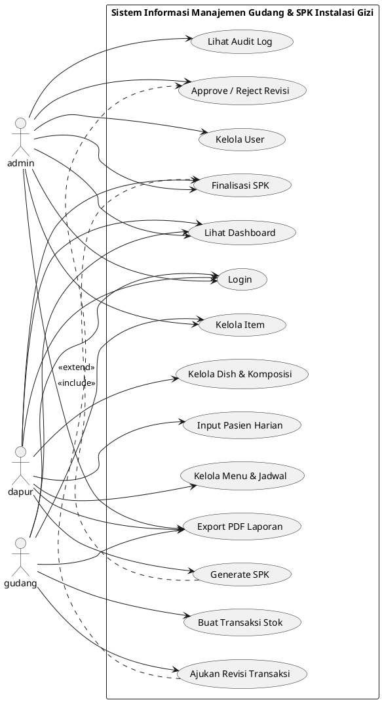

# Use Case Diagram — Sistem Informasi Manajemen Gudang dan SPK Instalasi Gizi RSD Balung

## 1. Overview

Dokumen ini memisahkan artefak use case dari dokumen desain utama dan sudah diselaraskan dengan DB diagram terbaru.

## 2. Actors

### 2.1 admin

Memiliki otoritas tertinggi. Aktor ini mengelola user, memantau audit, dan menyetujui atau menolak revisi transaksi.

### 2.2 dapur

Mengelola dish, komposisi bahan, menu, jadwal menu, input pasien, dan proses generate SPK.

### 2.3 gudang

Mengelola item operasional, transaksi stok masuk/keluar/retur, dan pengajuan revisi.

## 3. Main Use Cases

- Login
- Kelola User
- Kelola Item
- Kelola Dish dan Komposisi
- Kelola Menu dan Jadwal Menu
- Input Pasien Harian
- Buat Transaksi Stok
- Ajukan Revisi Transaksi
- Approve / Reject Revisi
- Generate SPK
- Finalisasi SPK
- Lihat Dashboard
- Lihat Audit Log
- Export Laporan PDF

## 4. Use Case Diagram (PlantUML)

## 5. Use Case Notes

### 5.1 Inventory Workflow

- Transaksi stok dibentuk dari header `stock_transactions` dan detail `stock_transaction_details`.
- Revisi transaksi tidak menghapus transaksi asal, tetapi merujuk ke `parent_transaction_id`.
- Status approval dikendalikan oleh `approval_statuses`.

### 5.2 Menu and SPK Workflow

- Kebutuhan bahan diturunkan dari `menu_schedules`, `menu_dishes`, dan `dish_compositions`.
- Input pasien harian berasal dari `daily_patients`.
- Hasil SPK disimpan ke `spk_calculations` dan `spk_recommendations`.

### 5.3 Reporting and Audit

- Audit log merekam aktivitas penting seperti login, create, update, delete, dan approval.
- Dashboard dan laporan membaca data final dari transaksi, stok, menu, dan SPK.
